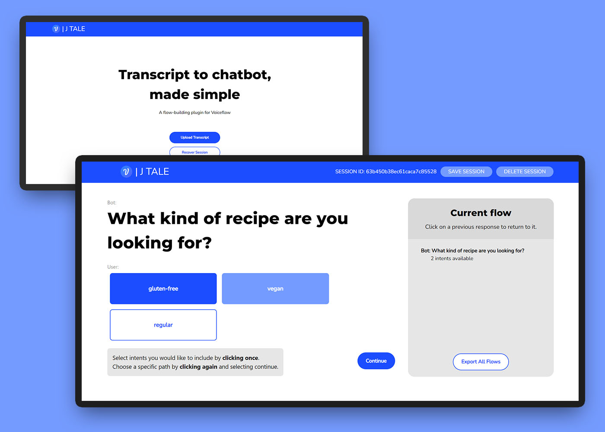

# J TALE: Auto-suggest for Chatbot Creators 

* **A project built by:** Emma Ho, Lucia Kim, Jacob Kolyakov, Anisha Latchman, Terry Tian
* Special thanks to UofT’s TLI Cohort 5 professors and teaching assistants!

## Demo

Visit the deployed site here: **https://jtale.netlify.app/**
Visit the Figma mockup here: **https://www.figma.com/file/tjtuN40Bv3Ny9ROuWNKF51/J-TALE-project-design?node-id=0%3A1&t=ZBXtdNJrjXTiJIRd-1**




## :telescope: Our Vision

*Time enables creativity, creativity drives innovation, and innovation is the future of technology.*

If you’re a chatbot creator, you would know just how time-consuming it can be to build conversation AI products, even while using an amazing collaboration platform like *Voiceflow*. 
And have you ever wondered… just how many more creative things you would be able to accomplish if you had just a little more time?

Well, we definitely have. Here at *J TALE*, we believe time and creative energy go hand-in-hand. By focusing our project on reducing the chatbot development time for creators by 25%, we’ve enabled time for making decisions, testing, and creating.

## :sparkles: How We Do It

Instead of having to think and type chatbot questions and responses manually, creators can build a chatbot with just a few buttons!
* Parse chatbot transcripts 
* Auto-suggest questions and responses in buttons
* Provide the option to include or exclude suggested prompts, creating a tree

## :computer:	Tech Stack

This project was made using the **MERN stack**: MongoDB, Express, Node.js, React
* **Testing:** Jest
* **Config:** Docker, Babel
* **Hosting:** Netlify, Google Cloud
* **Styling:** Tailwind CSS

## :file_folder: Getting Started

* Access our deployed site here: **https://jtale.netlify.app/**
* Access our project locally by downloading and opening the unzipped **J-TALE-main** folder of our project on a JavaScript editor. 
  * Add a **.env** file in the **client** folder including the following: 
  ```
  REACT_APP_BASE_URL=http://localhost:5000
  ```
  * Add a **.env** file in the **server** folder including the following:
  ```
  ATLAS_URI = # PRIVATE: please contact us for this information
  ```

### :runner: Running the Program

* In the **client** terminal, ```npm install``` to download a package file with its dependencies. Then, ```npm start``` to run the frontend. This will open a new browser:  http://localhost:3000/
* In the **server** terminal, ```npm install``` to download a package file with its dependencies. Then, ```npm start``` to run the backend. This will connect the frontend to MongoDB.

### :mag: Navigating the Project

* On the launched website there are two buttons: **Upload Transcript** and **Recover Session**. Click the one that applies to you. 
* When uploading a transcript, please upload a valid JSON transcript file — samples will be included in our **transcript** folder in the **client** folder. *For more information about what a valid transcript is, read the next section.*
* After entering a flow name of your choice, begin designing your flow!
  * Parsed questions and responses will be displayed. Clicking once includes the intents in your flow, clicking twice indicates that you are designing that branch/path first. 
    * **Note:** you cannot continue without choosing a specific branch/path (clicking twice on an intent button) first.
  * Click parts of the transcript to navigate back to that part of the flow.
* When finished, click **Save** on the navbar. This will lead you to a page with your flow ID so you can recover your session for next time.
* If you wish to delete your session, click **Delete Session**.
* **SUPER IMPORTANT**: We do not make use of any local storage so there will be issues if you refresh while you're inside a session (and you cannot upload the same transcript multiple times without deleting the session first). If you do refresh in a session, please go back to the base URL and recover your session. If you do not have access to your session id to recover the session, please reach out to one of the team members, so we can provide you with the necessary information.

## :pencil2: Transcript Format

The transcript must be in a JSON file with the following information:
```
{
  "questions": [
    [
      {
        "id": "enter ID",
        "question": "enter question",
        "question_included": false,
        "intents": [
          {
            "value": "enter response 1",
            "included": false,
            "children": [enter child IDs]
          },
          {
            "value": "enter response 2",
            "included": false,
            "children": [enter child IDs]
          },
          ... enter more responses as required ...
        ]
      },
      ... enter more questions as required ...
    ]
  ]
}
```
## :rotating_light: Testing

In both the **client** and **server** directories, ```npm test``` to run the tests we've set up and check code coverage.

## :bookmark_tabs: License

This project is licensed under the *Apache License 2.0*.

## :coffee: Trello 
https://trello.com/b/6HhbwIKN/jtale
